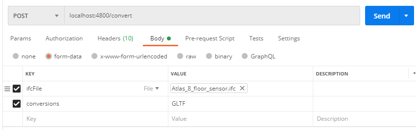

# Online open converter tool for IFC files - backend API
This is an online JS-based backend that allows converting IFC files to a number of other formats (LBD, ifcOWL, DAE, GLTF)

## Before installation
You need:
- Java version 8+
- Node.js

## Installation and getting started
Open console and run:
- `npm install`
- `npm run start`

## What can this converter do
After starting the tool, a web service is running on HTTP port 4800 (default). This web service allows converting IFC to a number of other data formats.

You can use this web service in a number of ways, of course. To test whether it is running, we recommend using https://www.postman.com/:

#### Test webservice
Open Postman and run the following HTTP Request:

```HTTP
GET /test
Host: localhost:4800
```

This should lead to the following response, showing that the code works.
```HTTP
HTTP/1.1 200 OK
Content-Type: text/html; charset=utf-8
Content-Length: 9

It Works!
```

#### Convert IFC files
Open Postman and run the following HTTP Request:

```HTTP
POST /convert
Host: localhost:4800
Content-Type: multipart/form-data
Body: {
  ifcFile: <fileUpload>
  conversions: "LBD, ifcOWL, DAE, GLTF"
}
```

Selecting a file in the body should look as follows:


You can specify LBD, ifcOWL, DAE, or GLTF as values for the conversion process. This request should lead to the following response, namely a ZIP folder as output file. Save the output and extract the converted file.
```HTTP
HTTP/1.1 200 OK
Content-Type: application/zip
Content-Disposition: attachment; filename="attachment.zip"
```

## Known issues
- The file path where the convertor is running should not contain spaces (e.g. this issue occurs in "Onedrive - myCompany" subfolders)

## Extend the app
If you care to extend the application so it can also output other formats: this is easily possible with a small number of code edits as long as you have an executable available of the conversion process.

## More info
Jeroen Werbrouck, UGent - jeroen.werbrouck@ugent.be

